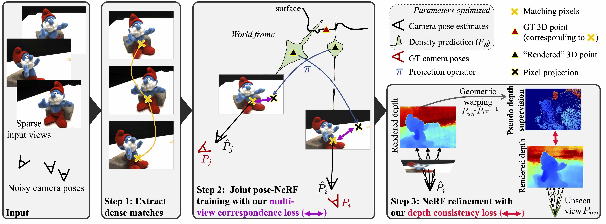
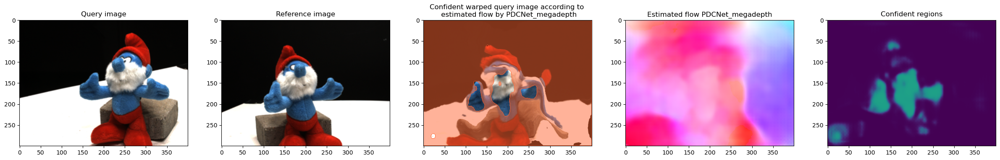

# SPARF: Neural Radiance Fields from Sparse and Noisy Poses

*This is not an officially supported Google product.*

This repository contains the code for the paper:
[SPARF: Neural Radiance Fields from Sparse and Noisy Poses](https://arxiv.org/abs/2211.11738). In CVPR, 2023 (Highlight). 

Authors: [Prune Truong](https://prunetruong.com/),
[Marie-Julie Rakotosaona](http://www.lix.polytechnique.fr/Labo/Marie-Julie.RAKOTOSAONA/),
[Fabian Manhardt](https://campar.in.tum.de/Main/FabianManhardt),
and [Federico Tombari](https://federicotombari.github.io/)   


\[[arXiv preprint](https://arxiv.org/abs/2211.11738)\]
\[[Website](https://prunetruong.com/sparf.github.io/)\]
\[[Youtube teaser](https://www.youtube.com/watch?v=ARMKrcJlULE)\]


Our approach SPARF produces realistic novel-view rendering given as few as 2 or 3 input images, with noisy camera poses. We add two novel constraints into the pose-NeRF optimization: the multi-view correspondence loss and the depth-consistency loss. 




Please contact Prune Truong (prune.truong@vision.ee.ethz.ch) if you have any questions!


We provide PyTorch code for all experiments: BARF/SPARF for joint pose-NeRF training, NeRF/SPARF when considering fixed ground-truth poses as input.


--------------------------------------
## Citation

If you find our code useful for your research, please cite
```
@inproceedings{sparf2023,
  title={SPARF: Neural Radiance Fields from Sparse and Noisy Poses},
  author = {Truong, Prune and Rakotosaona, Marie-Julie and Manhardt, Fabian and Tombari, Federico},
  publisher = {{IEEE/CVF} Conference on Computer Vision and Pattern Recognition, {CVPR}},
  year = {2023}
}
```

--------------------------------------

## Installation

This code is developed with Python3 (`python3`) with Cuda 11.3. All models were trained on single A100 (or V100) GPU with 20GB of memory. This code does NOT support multi-GPU training. 
Please use the following command for installation. 

* It is recommended to use [Anaconda](https://www.anaconda.com/products/individual) to set up the environment. Install the dependencies and activate the environment `sparf-env` with
```bash
conda create -n sparf-env python=3
conda activate sparf-env
pip install -r requirements.txt
```
For the specific versions of the packages used to develop this model, run the following instead. 
```bash
pip install -r requirements_w_version.txt
```

* Make sure to the dependencies of the submodules are downloaded. Everything should be included in the provided requirement file, except for cupy:
We use [PDC-Net](https://arxiv.org/abs/2101.01710) to extract correspondences between the views, for which CuPy is a required dependency. It can be installed using pip install cupy or alternatively using one of the provided binary packages as outlined in the CuPy repository. For another CUDA version, change accordingly.
```bash
pip install cupy-cuda113 --no-cache-dir 
```

* Initialize the external submodule dependencies with
```bash
git submodule update --init --recursive
git submodule update --recursive --remote
```

* Optional: The submodule contains lots of unnecessary files. You can suppress them by running
```bash
bash third_party/remove_unused_files.sh
```

* Create source/admin/local.py by running the following command and update the paths to the datasets and workdirs. 
We provide an example admin/local_example.py where all datasets are stored in data/. 
```bash
python -c "from source.admin.environment import create_default_local_file; create_default_local_file()"
```

* Download the pre-trained model of [PDC-Net](https://arxiv.org/abs/2101.01710) [here](https://drive.google.com/file/d/1nOpC0MFWNV8N6ue0csed4I2K_ffX64BL/view). You will need to change the path to the pre-trained model in [train_settings/default_config.py](https://github.com/google-research/sparf/blob/main/train_settings/default_config.py#L190) `cfg.flow_ckpt_path` (L.190). 

<details>
  <summary><b>Make sure the correspondence network is installed and running correctly</b></summary>

Run the following command
```bash
python third_party/test_pdcnet_installation.py
```
You should obtain the following image as third_party/test_pdcnet.png




</details>

--------------------------------------

## Datasets


<details>
  <summary><b>DTU</b></summary>

* Images: We use the DTU dataset, processed by PixelNeRF, where the images are processed and resized to 300 x 400.
Download the data [here](https://drive.google.com/drive/folders/1PsT3uKwqHHD2bEEHkIXB99AlIjtmrEiR?usp=sharing). 

* Mask Data: For evaluation, we report also masked metrics. For this, we use the object masks provided by DVR, IDR and RegNeRF. [RegNeRF](https://github.com/google-research/google-research/tree/master/regnerf) provides the full mask data (for the test splits), which you can download [here](https://drive.google.com/file/d/1Yt5T3LJ9DZDiHbtd9PDFNHqJAd7wt-_E/view?usp=sharing). 

* Ground-truth depth maps: For evaluation, we report the depth error. For this, we download the [depth maps](https://virutalbuy-public.oss-cn-hangzhou.aliyuncs.com/share/cascade-stereo/CasMVSNet/dtu_data/dtu_train_hr/Depths_raw.zip). They are extracted from [MVSNeRF](https://github.com/apchenstu/mvsnerf#:~:text=training%20data%20and-,Depth_raw,-from%20original%20MVSNet).  

</details>


<details>
  <summary><b>LLFF</b></summary>

The LLFF real-world data can be found in the [NeRF Google Drive](https://drive.google.com/drive/folders/128yBriW1IG_3NJ5Rp7APSTZsJqdJdfc1).
For convenience, you can download them with the following script: (under this repo)
```bash
gdown --id 16VnMcF1KJYxN9QId6TClMsZRahHNMW5g # download nerf_llff_data.zip
unzip nerf_llff_data.zip
rm -f nerf_llff_data.zip
mv nerf_llff_data data/llff
```

</details>

<details>
  <summary><b>Replica</b></summary>

You can download the replica dataset with the following script:
```bash
# you can also download the Replica.zip manually through
# link: https://caiyun.139.com/m/i?1A5Ch5C3abNiL password: v3fY (the zip is split into smaller zips because of the size limitation of caiyun)
wget https://cvg-data.inf.ethz.ch/nice-slam/data/Replica.zip
unzip Replica.zip
  ```
</details>

--------------------------------------


## I. Running the code

### Training: Quick start

The installation should have generated a local configuration file "admin/local.py". 
In case the file was not generated, run 
```python -c "from source.admin.environment import create_default_local_file; create_default_local_file()"```to generate it. 
* Next, set the paths to the training workspace `self.workspace_dir`, i.e. the directory where the model weights and checkpoints will be saved. 
* Set the path to `self.tensorboard_dir`, where the tensorboard files will be stored 
* Set the path to `self.log_dir`, where the logs will be stored
* Set the path to `self.eval_dir`, where the test results will be stored. 
* Also set the paths to the datasets you want to use (and which should be downloaded beforehand, see above). 

* Set the path to the [PDC-Net](https://arxiv.org/abs/2101.01710) pre-trained model (previously downloaded) in train_settings/default_config.py `cfg.flow_ckpt_path`. 

        
If all the dependencies have been correctly installed, you can train/evaluate a network using the run_trainval.py script in the correct conda environment. All checkpointing, logging and saving metrics should be done automatically. 

```bash
conda activate sparf-env
# Selecting <train_module> <train_name> <nbr_input_views> <scene_name>
python run_trainval.py <train_module> <train_name> --train_sub <nbr_input_views> --scene <scene_name>
```
Here, train_module is the sub-module inside train_settings and train_name is the name of the train setting file to be used.

The snapshots along with a video of the RGB and depth renderings will be saved in the directory `workspace_dir/<train_module>/subset_<nbr_input_views>/<scene_name>/<train_name>`.

The corresponding tensorboard file will be stored in `tensorboard_dir/<train_module>/subset_<nbr_input_views>/<scene_name>/<train_name>`.

where `workspace_dir` and `tensorboard_dir` were set in the `source.admin.local.py` file. 


Running this command directly computes results on the test set at the end of training, which will be stored in `eval_dir/dataset_name/<train_module>/subset_<nbr_input_views>/<scene_name>/<train_name>`.
If you wish to recompute them, or re-generate the video rendering, run: 

```bash
# Selecting <train_module> <train_name> <nbr_input_views> <scene_name>
# to regenerate the test metrics 
python run_trainval.py <train_module> <train_name> --train_sub <nbr_input_views> --scene <scene_name> --test_metrics_only True 

# to regenerate the video of the renderings
python run_trainval.py <train_module> <train_name> --train_sub <nbr_input_views> --scene <scene_name> --render_video_only True 

```

<br />

### Training: Example 

The configs are found in train_settings

For example, you can train using the included default SPARF settings for joint pose-nerf training on DTU, starting from initial noisy poses (3 views) by running:
```bash
python run_trainval.py joint_pose_nerf_training/dtu sparf --train_sub 3 --scene scan82
```
All the snapshots will be stored in the directory `workspace_dir/joint_pose_nerf_training/dtu/subset_3/scan82/sparf`. All the tensorboard will be stored in `tensorboard_dir/joint_pose_nerf_training/dtu/subset_3/scan82/sparf`.


Running this command directly computes results on the test set at the end of training, which will be stored in `eval_dir/dtu/joint_pose_nerf_training/dtu/subset_3/scan82/sparf`.


<br />

### Visualizing the results
  We have included code to visualize the training over TensorBoard.
  The TensorBoard events include the following:
  - **SCALARS**: the rendering losses and PSNR over the course of optimization. For joint pose-NeRF optimization, the rotational/translational errors with respect to the given poses are also computed. The validation metrics are also logged. 
  - **IMAGES**: visualization of the RGB images and the RGB/depth rendering. For joint pose-NeRF optimization, we also plot the optimized and ground-truth poses. 
  

  At the end of the training, a video of the RGB and depth renderings is created, and saved with the snapshots. The poses used for the rendering are jitters of the optimized (or ground-truth) input poses. 


<br />

### Evaluation of pre-trained models 

The computation of the test metrics is included at the end of the training. But it must correspond
to an existing train_settings file. To evaluate any given pre-trained models (associated with its
options.yaml file), run: 
```bash
# Selecting <ckpt_dir> <out_dir> <expname>
python eval.py --ckpt_dir <ckpt_dir> --out_dir <out_dir> --expname <expname> --plot True

```

This will save the metrics file at `<out_dir>/<expname>.json`. if `--plot` is True, figures of the renderings are saved in `<out_dir>/<expname>/`. 
<ckpt_dir> is the path to a **directory** containing a checkpoint (the latest will automatically be loaded) and an option file named `options.yaml`. 

We provide pre-trained models for some of the experiments and some of the scenes [here](https://drive.google.com/drive/folders/1b3atnbgyR8macgZCvL4OneoLgrOMt6Mz?usp=share_link). 

To make sure the code is running fine, for joint_pose_nerf_training/dtu/scan82, you should get similar metrics (with test-time optimization):
  
|              | Rot. error | Trans. error | PSNR (masked) | SSIM (masked) | LPIPS (masked) | Depth err.
|--------------|--------|---------|---------|--------------|---------|--------------|
| SPARF (Ours)  |  0.70 | 0.0097 | 17.58 (17.36) | 0.82 (0.91) | 0.19 (0.07) | 0.15


<br />

### Reproducing results from the publication 

<details>
  <summary><b>Joint pose-NeRF optimization on DTU from noisy poses (Tab. 4)</b></summary>

In Tab. 4 of the main paper, we present results of the joint pose-NeRF optimization on DTU, starting from 3 images with noisy poses. To reproduce those results, run these commands for each of the 15 scenes. The results presented are the average over all scenes. 
```bash
# <SCENE> is specific to datasets
# DTU (<SCENE>={'scan8', 'scan21', 'scan30', 'scan31','scan34', 'scan38','scan40','scan41','scan45','scan55','scan63','scan82','scan103','scan110','scan114'})

# SPARF
python run_trainval.py joint_pose_nerf_training/dtu sparf --scene=<SCENE> --train_sub 3

# SPARF without depth-consistency loss
# Note that the depth-consistency loss adds training time and only leads to 
# a minor improvement. We therefore also include a version without the depth
# consistency loss 
python run_trainval.py joint_pose_nerf_training/dtu sparf_wo_depth_cons_loss --scene=<SCENE> --train_sub 3

# Baseline BARF
python run_trainval.py joint_pose_nerf_training/dtu barf --scene=<SCENE> --train_sub 3
```

To make sure the code is running fine, for scene='scan82', you should get similar metrics (with test-time optimization):
  
|              | Rot. error | Trans. error | PSNR (masked) | SSIM (masked) | LPIPS (masked) | Depth err.
|--------------|--------|---------|---------|--------------|---------|--------------|
| BARF | 13.28 | 0.41 | 7.79 (6.11) | 0.45 (0.77) | 0.67 (0.28) | 1.53
| SPARF (Ours)  |  0.70 | 0.0097 | 17.58 (17.36) | 0.82 (0.91) | 0.19 (0.07) | 0.15

Scene 'scan30' is an example of failure cases, because no correspondences can be reliably extracted. 

<br /><br />

We provide pre-trained models of our SPARF with 3 input views for all 15 scenes [here](https://drive.google.com/drive/folders/1s0HcDEgEVFX7-rgnUgsKAolvElGNT1R8?usp=share_link). To evaluate them, run
```bash
# Selecting <ckpt_dir> <out_dir> <expname>
python eval.py --ckpt_dir <ckpt_dir> --out_dir <out_dir> --expname <expname> --plot True
```

</details>


<details>
  <summary><b>Joint pose-NeRF optimization on LLFF from identity poses (Tab. 5)</b></summary>

In Tab. 5 of the main paper, we present results of the joint pose-NeRF optimization on LLFF, given 3 images with identity initial poses. To reproduce those results, run these commands for each of the 8 scenes. The results presented are the average over all scenes. 
```bash
# <SCENE> is specific to datasets
# LLFF (<SCENE>={'orchids', 'horns', 'trex', 'fern', 'flower', 'leaves', 'room', 'fortress'})

# SPARF
python run_trainval.py joint_pose_nerf_training/llff sparf --scene=<SCENE> --train_sub 3

# SPARF without depth-consistency loss
python run_trainval.py joint_pose_nerf_training/llff sparf_wo_depth_cons_loss --scene=<SCENE> --train_sub 3

# Baseline BARF
python run_trainval.py joint_pose_nerf_training/llff barf --scene=<SCENE> --train_sub 3
```

To make sure the code is running fine, for scene='horns', you should get similar metrics (with test-time optimization):
  
|              | Rot. error | Trans. error | PSNR | SSIM | LPIPS |
|--------------|--------|---------|---------|--------------|-----|
| BARF | 5.53 | 0.326 | 14.34 | 0.34 | 0.54 | 
| SPARF (Ours)  |  0.027   |  0.002| 18.94 | 0.61 | 0.33
</details>


<details>
  <summary><b>Joint pose-NeRF optimization on Replica from COLMAP poses (Tab. 6)</b></summary>

In Tab. 6 of the main paper, we present results of the joint pose-NeRF optimization on Replica, starting from 3 images with initial poses obtained by COLMAP with PDC-Net matches. To reproduce those results, run these commands for each of the 7 scenes. The results presented are the average over all scenes. 
```bash
# <SCENE> is specific to datasets
# Replica (<SCENE>={'room0', 'room1', 'room2',  'office0', 'office1', 'office2', 'office3'})

# SPARF
python run_trainval.py joint_pose_nerf_training/replica sparf --scene=<SCENE> --train_sub 3

# SPARF without depth-consistency loss
python run_trainval.py joint_pose_nerf_training/replica sparf_wo_depth_cons --scene=<SCENE> --train_sub 3

# Baseline BARF
python run_trainval.py joint_pose_nerf_training/replica barf --scene=<SCENE> --train_sub 3
```

To make sure the code is running fine, for scene='office0', you should get similar metrics (with test-time optimization):
  
|              | Rot. error | Trans. error | PSNR | SSIM | LPIPS | Depth err. |
|--------------|--------|---------|---------|--------------|---------|--------------|
| BARF | 5.37 | 0.28 | 22.33 | 0.72 | 0.30 | 0.59 | 
| SPARF (Ours)  |    0.58 |0.010 | 28.38 | 0.90 | 0.13 | 0.36 |

</details>


<details>
  <summary><b> NeRF optimization on DTU with fixed ground-truth poses (Tab. 7)</b></summary>

In Tab. 7 of the main paper, we present results of NeRF-based approaches, trained with fixed ground-truth camera poses. To reproduce those results, run these commands for each of the 15 scenes. The results presented are the average over all scenes. 
```bash
# <SCENE> is specific to datasets
# DTU (<SCENE>={'scan8', 'scan21', 'scan30', 'scan31','scan34', 'scan38','scan40','scan41','scan45','scan55','scan63','scan82','scan103','scan110','scan114'})

# SPARF
python run_trainval.py nerf_training_w_gt_poses/dtu sparf --scene=<SCENE> --train_sub 3


# Baseline NeRF
python run_trainval.py nerf_training_w_gt_poses/dtu nerf --scene=<SCENE> --train_sub 3
```

To make sure the code is running fine, for scene='scan82', you should get similar metrics:
  
|              | PSNR (masked) | SSIM (masked) | LPIPS (masked) | Depth err. |
|--------------|--------|---------|---------|--------------|
| NeRF | 4.57 (5.36) | 0.28 (0.77) | 0.28 (0.32) | 1.35 |
| SPARF (Ours)  |  18.42 (21.71) | 0.87 (0.95) | 0.16 (0.04)  | 0.24  |

</details>


<details>
  <summary><b> NeRF optimization on LLFF with fixed ground-truth poses (Tab. 7)</b></summary>

In Tab. 7 of the main paper, we present results of NeRF-based approaches, trained with fixed ground-truth camera poses. To reproduce those results, run these commands for each of the 8 scenes. The results presented are the average over all scenes. Almost the same results are obtained using hierarchical sampling, or with only a coarse sampling. 
```bash
# <SCENE> is specific to datasets
# LLFF (<SCENE>={'orchids', 'horns', 'trex', 'fern', 'flower', 'leaves', 'room', 'fortress'})

# SPARF
python run_trainval.py nerf_training_w_gt_poses/llff sparf --scene=<SCENE> --train_sub 3


# Baseline NeRF
python run_trainval.py nerf_training_w_gt_poses/llff nerf --scene=<SCENE> --train_sub 3
```

To make sure the code is running fine, for scene='horns', you should get similar metrics:
  
|              | PSNR (masked) | SSIM (masked) | LPIPS (masked) | 
|--------------|--------|---------|---------|
| NeRF |  13.21 | 0.26 | 0.61 | 
| SPARF (Ours)  | 19.39 | 0.64 | 0.29 | 

</details>

--------------------------------------


## II. Using a pre-trained model

You can find our pre-trained models (from running this repo), following the same structures as our train_settings files, [here](https://drive.google.com/drive/folders/1b3atnbgyR8macgZCvL4OneoLgrOMt6Mz?usp=share_link).
After downloading the checkpoints, you can evaluate the model and render test images as indicated above.


--------------------------------------


## III. Downloading model predictions

If you don't want to run the code, you can also directly download the renderings of our models for the test set poses using the following link: https://drive.google.com/drive/folders/1lHryExsutZsbcKJlzO7QKM34YlUwKSSx?usp=share_link. The structure follows that of the train_settings files. They correspond to the renderings used in the paper, so they will be a bit different compared to the ones obtained when running the provided pre-trained models (for which the training was done with this codebase). 

--------------------------------------
## IV. Codebase structure

For details on the dataloader and how to use your own, refer to [this doc](https://github.com/google-research/sparf/blob/main/docs/code_documentation.md). 

The framework in `source/` consists of the following sub-modules.

* training: 
    * core: the losses, sampling strategy and metric files
    * engine: Classes for main training routine 
    * base.py: Base class for the NeRF/pose trainer. All the others inherit from it. 
    * **nerf_trainer.py**: The main engine for training a NeRF model, considering **fixed ground-truth poses**. Only the NeRF model is optimized. It inherits base.py. 
    * **joint_pose_nerf_trainer.py**: The main engine for training of the NeRF model jointly with refining initial noisy camera poses. This corresponds to SPARF's main use case. Optimized are the NeRF model and the camera pose estimates. It inherits nerf_trainer.py. 
    * **nerf_trainer_w_fixed_colmap_poses.py**: The main engine for training a NeRF model, considering fixed poses, obtained from COLMAP (or some other initialization). The poses are therefore most likely noisy. Only the NeRF model is optimized. This is to show comparison to the joint refinement.  It inherits nerf_trainer.py. 
* train_settings: Contains config files, specifying the training of a network. For each experiment, we create a new config file in train_settings. The logging and saving will adapt accordingly so only the config file needs to be created in train_settings. 
* admin: Includes functions for loading networks, tensorboard etc. and also contains environment settings.
* datasets: Contains integration of a number of datasets. All datasets inherent from the base Dataset class in datasets/base.py
* utils: Contains functions for logging, visualizations, geometric operations and colmap initalization. 
    * geometry: Utils for geometric transformations 
    * colmap_initialization: Utils to initializes poses with COLMAP, run with different matchers
* models: Contains NeRF model definition, different pose parametrization and the correspondence network wrapper. 


Some tips on using and understanding the codebase:
- Throughout the code base, the pose convention is [right, down, forward]. This is the standard form of camera extrinsic projection matrices in the notation of multi-view geometry (opencv, colmap). It transforms a world-frame 3D point x to the camera frame and projects it to pixel coordinates u with the standard equation u = K (R^{w2c} x + t^{w2c}). 
- We create a config file for each experiments (including changing each hyper-parameters). If you want to create a different experiment, create a new config file with a different name. 
- The configuration will be loaded as the variable `opt` and `self.settings` throughout the codebase.  
- The data for the whole scene is loaded at the beginning of the training, after creating the dataset. Throughout the codebase, it is stored in `data_dict`. Important keys are 'image' (B, 3, H, W), 'pose' (w2c ground-truth poses in format (B, 3, 4)) and 'intr' (B, 3, 3). When the poses are optimized, the current estimate of the poses are stored in `data_dict.poses_w2c`. 
- The output of the NeRF model (computation graph for forward/backprop) is stored in `output_dict` throughout the codebase.
- The loss factory can be found in [training/core/loss_factory.py](https://github.com/google-research/sparf/blob/main/source/training/core/loss_factory.py). In the config, the loss to use is defined as a string in `opt.loss_type`. The final loss can be a combination of multiple loss functions. The losses values are stored in a dict `loss_dict`. The weights of each are defined in `opt.loss_weight.<name>`. The final overall loss is automatically computed based on the defined `opt.loss_type` and `opt.loss_weight`. 
To add a new loss function, create a new class with a main function `compute_loss()`. Add this new class to the loss factory. The output of the `compute_loss()` function should be `loss_dict`, `stats_dict` and `plotting_dict`. The actual loss value for backward is stored in `loss_dict.<name>`. You also need to add the new loss weight to `opt.loss_weight.<name>`. It will automatically be added to the overall loss and logged to Tensorboard.

- If you are using a multi-GPU machine, you can add `--gpu=<gpu_number>` to specify which GPU to use. **Multi-GPU training/evaluation is currently not supported.**
- The code was designed for a limited number of views. If loading many views instead and computing the correspondences exhaustively between the views, you might run into out-of-memory issues. 
- If restarting the training of an experiment, it will automatically load the last saved checkpoint. 
- (to be continued....)
  


--------------------------------------
## V. License
This code is licensed under the Apache 2.0 License. See [LICENSE](https://github.com/google-research/sparf/blob/main/LICENSE) for more details.


